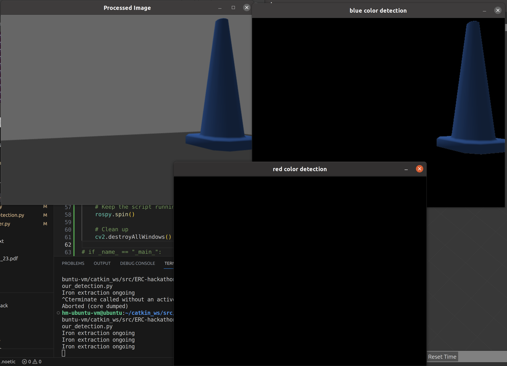

# ERC Hackathon 2023 submission

### Mechanical

**Design**:

Model files can be found in the `mechanical/` directory or https://a360.co/45wuxL5

**Ansys Analysis**:

Report can be found [here](mechanical/ansys%20analysis/ERC%20HACK%20ANSYS%20MINED.pdf)

### Electronics

Part 1:

[link](https://www.tinkercad.com/things/8tS4cQEKOlx?sharecode=zMyGMb17AG04Dq2QzwaMsAUVSxyepGBn6ncqBjoWyT0)

The differential drive mechanism is a simple 4wd that takes in (linear.x and angular.z) from ROS controller which will accordingly turn the motors.

Part 2:

[link](https://www.tinkercad.com/things/2AzpW1k3oru?sharecode=b2Rh3jejDMBBp6OE0veHATIasINy7RtwA5-mOQYV0L8)

Part 3-6:

[link](https://www.tinkercad.com/things/doNj9fPPetp?sharecode=6bNxCSpgDcdtsFkDNGaQSvCr4-Utx1kQABxrum8ldWc)

Combined all tasks in one circuit.

#### Coil Mechanism

The Sinusoidal wave produced will be connected to a copper coil (basically an inductor). Another copper coil will be receiving the voltage. When connected across a capacitor and near a mine, due to metal eddy currents, there will be changes across voltage in capacitor measured by Arduino.

#### PCBs

The necessary PCBs can be fouond in the `electronics/` directory.

### Automation

**Color Detection**

Cone detection as follows:

**Path Planning**

Example path

Used RRT to create a path, also edited the `obstacle_detection.py` for path to be far away from walls, so that robot doesn't crash with it.

**Controller**

Simple controller for robot to navigate along the planned path. `controller.py`

[demo video of robot moving](misc/final_vid_of_robo_navigating.mp4)

**Others**

run `catkin_make` after cloning in the `~/catkin_ws/src` directory.

Path planner uses RRT to make calculate a path which goes over all points.

`roslaunch robotics_hackathon_automation automation_task.launch`